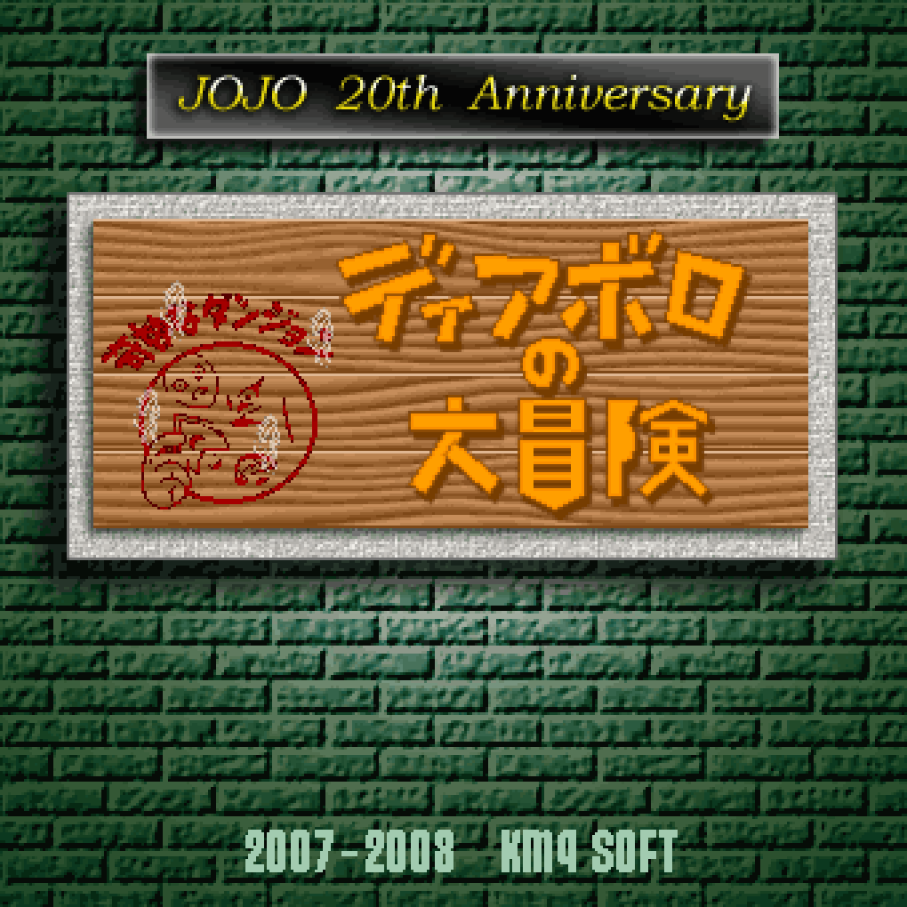

# newDTW — Diavolo The Wanderer (Engine Study)

> An engine-level rebuild of a classic fan-made mystery dungeon roguelike
> originally created by KMQ SOFT. Maintained as a personal technical study
> and archive; **no binaries are distributed** (see *Project Status & Provenance*).

<a href="https://github.com/sponsors/zawatton"></a>

<p align="center">
  
</p>

## What is this?

**Diavolo The Wanderer** (ディアボロの大冒険) is a mystery dungeon roguelike set in the JoJo's Bizarre Adventure universe. The original game, created by KMQ SOFT using HSP (Hot Soup Processor), became a cult classic in Japan before development ended in 2008.

**newDTW** is a ground-up engine rebuild:
- **HSP &rarr; TypeScript** — 100K+ lines of HSP source ported to modern TypeScript
- **Browser-playable** — GitHub Pages deployment explored (see Roadmap)
- **Electron / Tauri desktop** — runnable locally for personal use
- **Engine source shared publicly** — game logic and tooling live in this repo; audio and other licence-restricted assets do not (see *Audio Assets & Distribution Policy*)

## Features

- Classic mystery dungeon gameplay with Stand abilities and items from JoJo Parts 1-6
- 1,050+ game functions fully ported from original HSP source
- 28,000+ sprite cells with per-pixel rendering via SpriteManager
- Map theme system for custom dungeon tilesets
- Backwards-compatible `gcopy` adapter — original rendering calls work alongside new sprite API

## Quick Start

### Run Locally (Electron)

```bash
git clone https://github.com/zawatton/newDTW.github.io.git
cd newDTW.github.io
npm install
npm run build
npm start          # launches Electron app
```

### Play in Browser

Hosted GitHub Pages build is **planned but not yet deployed** — see Roadmap below.
For now, after `npm install` you can produce a browser bundle locally:

```bash
npx webpack --config webpack.browser.cjs   # writes public/bundle/main.js
# then open public/index.html via any local web server
```

**Requirements:** Node.js 18+, Python 3.10+ (for tools; needs Pillow + numpy)

**Audio note:** `assets/bgm/` and `assets/se/` are not included in this repository (see *Audio Assets & Distribution Policy* below). The game runs silent without them; add your own locally-sourced files to re-enable sound during development.

### Development Workflow

For active development, use the hot-reload mode — webpack watches source files
and Electron auto-reloads the window on bundle updates.

```bash
npm run dev        # webpack -w + Electron with hot reload
```

**Automated test scenarios** (Electron-based, takes screenshots to `tools/screenshots/`):

```bash
npm run test:smoke    # quick startup verification
npm run test:menu     # system settings menu (cursor positions 0-7)
npm run test:lang     # language submenu (Japanese/English)
npm run test:i18n     # i18n rendering check (both languages)
```

**Generated documentation:**

```bash
npm run docs:vars     # → docs/variable_dictionary.md
```

### Debug API

A runtime debug API is exposed at `window.debug` in the renderer process.
Use DevTools or test scenarios to manipulate game state:

```javascript
debug.setLang('en')           // switch language
debug.openSystemMenu(0)       // jump into system settings
debug.godMode(true)           // invincibility
debug.teleport(x, y)          // move player
debug.help()                  // full API list
```

### Internationalization (i18n)

newDTW supports multilingual UI through a lightweight i18n layer (`src/renderer/i18n.ts`):

- Translation dictionaries live in `assets/lang/<code>.json` (currently `en.json`)
- The `installAutoTranslate(Gvar, key)` hook auto-translates large message
  properties (e.g., `effects_message` with 350+ assignments) without code changes
- `Adap.dialog()` and the menu system pass strings through `t()` automatically

## Project Structure

```
src/
  main/
    main.ts         Electron main process (window management, IPC, hot reload)
  renderer/
    adapter/        HSP-to-TS adapter layer (gcopy, picload, SpriteManager)
    func/           Main game logic (func000 - func1056)
    menu/           Menu system (MenuController + per-menu configs)
    enemy/          Enemy AI and data
    stand/          Stand DISCs and items
    dungeon/        Dungeon generation and processing
    i18n.ts         Internationalization core
    debug.ts        Runtime debug API (window.debug.*)
    variable.ts     Global game state (Gvar) — 7,600+ lines of HSP-derived state
    ...
assets/
  sprites/          Individual sprite PNGs + manifest.json
  img/              Legacy sprite sheets
  lang/             i18n translation dictionaries (en.json, ...)
tools/              Dev tools — see "Development Workflow" above
docs/               Auto-generated documentation (variable dictionary, etc.)
```

## Contributing

Contributions welcome — code, pixel art, translations, bug reports.

Join the development on Discord: DM **zawatton** to get started.

### Adding Content

**Stand DISCs / Items:**
1. Place 40x40 PNG in `assets/sprites/`
2. Register in `manifest.json`
3. Use `Adap.spriteManager.draw("category/name")` to render

**Map Themes:**
```bash
python tools/add_map_theme.py my_tiles/ 27 "New Dungeon"
```

## Roadmap

- [ ] **GitHub Pages deploy** — make the game playable in-browser without local install
  - Browser webpack config (`webpack.browser.cjs`) builds a 15 MiB `main.js` that runs in the browser today
  - Blockers before public deploy:
    - Asset hosting strategy — `assets/bgm/` (359 MiB) and `assets/sprites/` (104 MiB) currently live outside git; needs CDN or compressed sprite bundle
    - GitHub Actions workflow (`actions/deploy-pages@v4`) to build + publish on push
    - URL/path settings — repo is `zawatton/newDTW.github.io` (project page), so paths in `index.html` need adjusting
  - Current state: local browser build verified (`npx webpack --config webpack.browser.cjs`); deployment pipeline TBD
- [ ] Custom version content (v0.14-0.16 features)
- [ ] Parts 7 & 8 characters and Stands
- [x] Internationalization scaffolding — Japanese / English (in-game language switcher)
- [ ] Translation dictionary expansion (effects messages, dialogs)
- [ ] Internationalization (Chinese, others)
- [ ] Original BGM to resolve copyright

## Project Status & Provenance

This repository is a **fork** of [github.com/newDTW/newDTW.github.io](https://github.com/newDTW/newDTW.github.io), which itself ported the KMQ SOFT fan-game to TypeScript. Significant additional work in this fork (Tauri integration, SpriteManager, i18n scaffolding, tooling, ~100K lines of further TS porting) is original to this fork, but the project as a whole inherits several unresolved intellectual-property questions that potential users should understand before cloning:

- **Upstream licence is unspecified.** The upstream repository does not carry a `LICENSE` file. Under GitHub's Terms of Service, public repositories without a licence permit forking and viewing, but do not grant any redistribution or re-use rights beyond that. This fork therefore cannot, and does not, claim to be cleanly "open-source" in the formal sense.
- **Inherited subject matter.** The original game is a fan-derivative work referencing *JoJo's Bizarre Adventure* (© Hirohiko Araki / Shueisha) and uses music loosely inspired by real-world artists. None of those rights have been cleared.
- **Why this fork still exists.** The maintainer ( [zawatton](https://github.com/zawatton) ) played the original KMQ SOFT game as a child and considers the engine and gameplay a work worth preserving as a technical study. The fork is kept public so that the TypeScript port remains visible and auditable, not as a distribution channel for the game itself.

**Current policy (see the sections below for enforcement details):**

1. **No binary distribution.** GitHub Releases do not carry runnable builds, and CI is configured for compile-verification only (`.github/workflows/tauri-build.yml`).
2. **No redistribution of audio or other licence-restricted assets.** `assets/bgm/` and `assets/se/` are gitignored; only the license ledger README files are tracked.
3. **Runtime tolerates missing assets.** The engine keeps running silently when audio is absent, so the repository alone constitutes a complete engine study without needing to ship any licence-encumbered material.
4. **Eventual clean-room direction (aspirational).** Replace audio track-by-track with originally-authored / CC0 material and, if ever pursued for public release, rename JoJo-specific identifiers to create an independently-clearable derivative.

If you are the upstream maintainer or a rights holder and you would like changes to how this fork is presented or maintained, please open an issue on this repository or contact the maintainer directly.

---

## Credits

### Original Game
- **KMQ SOFT** (Clive, Munier, qra) — original *Diavolo The Wanderer* (v0.13)

### Upstream TypeScript Port
- [github.com/newDTW/newDTW.github.io](https://github.com/newDTW/newDTW.github.io) — the initial TypeScript port that this repository forks from.

### Custom Versions
- Anonymous contributors — v0.14-0.16

### Open Source Version
- **zawatton** — TypeScript rebuild, SpriteManager, tooling

### Pixel Art Contributors
Many anonymous artists contributed enemy sprites, Stand DISCs, and items. See the full credits in the Japanese section below.

---

## Audio Assets & Distribution Policy

This repository contains the **game engine source only**. The following are deliberately **not** included and **not distributed** by this project:

- Background music tracks (`assets/bgm/`)
- Sound effects (`assets/se/`)
- Any pre-built binary release of the game with those assets embedded

**Why:** The original audio assets were not produced with redistribution rights. The upstream *Diavolo The Wanderer* project itself halted in 2008 in part because the combined licensing obligations (source music, JoJo IP, etc.) could not be resolved. newDTW inherits the same constraint and does not attempt to work around it.

**What this means in practice:**

- No binaries are published to GitHub Releases. The CI workflow (`.github/workflows/tauri-build.yml`) is configured for **compile-verification only** — it does not upload artifacts and does not create releases. Tag pushes no longer trigger builds.
- `assets/bgm/` and `assets/se/` are in `.gitignore`; only their `README.md` ledger files are tracked.
- The runtime (`src/renderer/adapter/bload.ts`) silently tolerates missing audio so the game continues to play without sound.
- `tools/stage_tauri.js --no-audio` (or `NEWDTW_NO_AUDIO=1`) skips audio staging for CI and clean-room builds.

**Long-term goal:** replace the audio track-by-track with original, CC0, or otherwise redistributable material so a proper public release becomes possible. See Roadmap item *"Original BGM to resolve copyright"*. Contributions toward this are welcome — see `assets/bgm/README.md` and `assets/se/README.md` for the license ledger format.

---

## License

See [LICENSE.md](LICENSE.md) for the terms this fork's maintainer applies to the code they personally wrote and contributed.

**Important caveats:**

- The upstream repository ([github.com/newDTW/newDTW.github.io](https://github.com/newDTW/newDTW.github.io)) does not specify a licence, so the portions of this tree inherited from upstream (and, transitively, from the original KMQ SOFT HSP source) are **not** covered by any clear grant of rights from their authors.
- `LICENSE.md` does not grant — and cannot grant — any rights to audio, sprite, character-name, or other third-party subject matter that may appear or may once have appeared in this tree. Such material is governed by the rights of its respective owners.
- Forking, cloning, and viewing this repository are permitted by GitHub's Terms of Service. Redistribution of the code beyond a personal fork, and any distribution of binaries built from it, are not endorsed by this repository's current policy.

---

<details>
<summary><strong>日本語README (Japanese)</strong></summary>

## はじめに

こちらは、ディアボロの大冒険の二次創作版 (自称オープンソース化プロジェクト)です。

KMQ SOFT が作成した「ジョジョの奇妙な冒険」の二次創作ローグライクゲーム「ディアボロの大冒険」。かつて一世を風靡したディアボロの大冒険ですが、その原作版の開発は2008年9月30日を持って終了しました。

こちらはファンの一人が作成した[ブラウザ版ディアボロの大冒険](https://github.com/newDTW/newDTW.github.io)のソースコードをフォークし、ディアボロの大冒険のオープンソース化を目指して開発を続けています。

## 構想

この newDTW は原作 Ver 0.13 を踏襲したブラウザ版から出発しています。今後の開発構想としては以下の通りです。

- **GitHub Pages へのデプロイ** — ブラウザでインストール不要プレイ化
  - ブラウザビルド (`webpack.browser.cjs`) は既に通る (約15 MiB)。残作業はアセット配信 (BGM 359 MiB / sprites 104 MiB) と CI ワークフロー
- 原作の開発が終了した後にファンによって開発されたカスタム版である Ver 0.14 ~ 0.16 の要素を追加
- 「ジョジョの奇妙な冒険」の第7部、第8部の要素を追加
- 日本語だけでなく英語や中国語など海外のプレイヤーを意識した多言語化
- BGMなどの著作権問題のクリア

## スタッフクレジット

### Special Thanks

#### ゲーム開発
- 原作者 (ver0.13まで): クライブ さま・ムニエル さま・qra さま (KMQ SOFTの御三方)
- カスタム版 ver0.14~0.16 の開発: 名も無き波紋使い
- 本オープンソース版: zawatton

#### ドット絵開発
ドット絵を作成していただいた方々、本当にありがとうございます。

- ゲーム全体: KMQ SOFT の御三方
- 敵キャラドット絵修正: 「名も無きスタンド使い」(30+ characters)
- スタンドDISC: 「名も無きスタンド使い」
- その他アイテム: 「名も無きスタンド使い」

</details>
